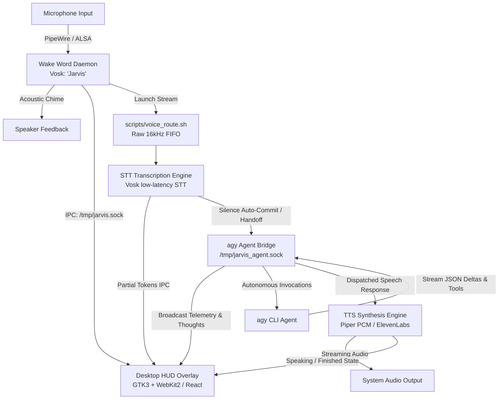

# J.A.R.V.I.S. (Just A Rather Very Intelligent System)

An ambient voice assistant, desktop HUD overlay, and autonomous agent supervisor engineered for Linux.

J.A.R.V.I.S. provides an always-available, floating desktop HUD, offline acoustic wake-word detection, low-latency streaming speech-to-text (STT), bidirectional bridge integration with the `agy` CLI agent framework, and high-fidelity neural text-to-speech (TTS).

---

## Architecture Overview



### Core Subsystems

1. **Desktop HUD Overlay (`daemon/overlay_window.py` & `src/App.tsx`)**
   - Transparent, borderless, floating reactive heads-up display.
   - Built with React 19, Vite, and Tailwind CSS; hosted natively via Python GTK 3 and WebKit2GTK (`WebKit2 4.1`).
   - Listens on `/tmp/jarvis.sock` for IPC events, animating live audio waveforms, transcription token streams, agent analytical thinking, and tool execution status.

2. **Wake Word Daemon (`daemon/wake_word_daemon.py`)**
   - Offline, low-power acoustic engine using Vosk (`vosk-model-small-en-us-0.15`).
   - Continuously listens for `"Jarvis"` or `"Hey Jarvis"`.
   - Dispatches wake events to `/tmp/jarvis.sock`, triggers the acoustic acknowledgement chime (`wake_chime.wav`), and engages voice capture routing.

3. **Voice Routing & STT Pipeline (`scripts/voice_route.sh` & `daemon/transcription_service.py`)**
   - PipeWire (`pw-record`) or ALSA (`arecord`) audio capture pipeline routing 16kHz S16_LE audio into a dedicated FIFO (`$XDG_RUNTIME_DIR/jarvis_audio_stream.raw`).
   - Real-time speech transcription emitting streaming partials to the HUD.
   - Intelligent silence threshold detection (0.9s post-phrase commit) and voice-abort handling (`stop`, `cancel`, `quiet`).
   - Automatically hands clean prompts over to the agent bridge socket and halts audio recording.

4. **Agent Bridge Daemon (`daemon/agy_bridge.py`)**
   - Bidirectional Unix Domain Socket (`/tmp/jarvis_agent.sock`) and WebSocket (`ws://127.0.0.1:9002`) bridge.
   - Spawns `agy` CLI processes in streaming JSON mode (`--output-format stream-json`).
   - Intercepts tool execution steps, thinking phases, and response deltas to relay real-time telemetry to the overlay.
   - Pipes completed responses into the TTS engine.

5. **Text-to-Speech Engine (`daemon/tts_service.py` & `scripts/speak.sh`)**
   - Local, low-latency neural synthesis utilizing Piper (`en_GB-alan-medium.onnx`) with direct raw PCM streaming to `paplay`/`aplay`.
   - Optional high-fidelity fallback to ElevenLabs API when `ELEVENLABS_API_KEY` is present.
   - Enforces concise vocal responses, prevents speaker acoustic feedback loops, and triggers HUD auto-concealment upon completion.

6. **Emergency Stop Protocol (`scripts/emergency_stop.sh`)**
   - Immediate circuit-breaker script terminating audio capture, speech synthesis, sound playback, and active agent operations.

---

## Prerequisites & Dependencies

### 1. System Packages (Linux / Debian / Ubuntu)

Ensure the following native packages and audio utilities are installed:

```bash
sudo apt update
sudo apt install -y \
  python3-gi \
  gir1.2-gtk-3.0 \
  gir1.2-webkit2-4.1 \
  pipewire \
  pipewire-pulse \
  pulseaudio-utils \
  alsa-utils
```

### 2. Node.js & Frontend Build

Build the React HUD frontend:

```bash
# In the repository root
npm install
npm run build
```

This compiles the interface into the `dist/` directory, which is loaded directly by the native desktop HUD overlay.

### 3. Python Virtual Environment

Set up the dedicated Python environment:

```bash
python3 -m venv .venv
source .venv/bin/activate
pip install vosk sounddevice websockets piper-tts
```

### 4. Acoustic & Voice Models

Place the required offline models in your user cache:

- **Vosk STT Model:**
  ```bash
  mkdir -p ~/.cache/vosk
  cd ~/.cache/vosk
  wget https://alphacephei.com/vosk/models/vosk-model-small-en-us-0.15.zip
  unzip vosk-model-small-en-us-0.15.zip
  ```
  Expected path: `~/.cache/vosk/vosk-model-small-en-us-0.15`

- **Piper TTS British Voice Model:**
  ```bash
  mkdir -p ~/.cache/piper
  cd ~/.cache/piper
  wget https://huggingface.co/rhasspy/piper-voices/resolve/main/en/en_GB/alan/medium/en_GB-alan-medium.onnx
  wget https://huggingface.co/rhasspy/piper-voices/resolve/main/en/en_GB/alan/medium/en_GB-alan-medium.onnx.json
  ```
  Expected path: `~/.cache/piper/en_GB-alan-medium.onnx`

---

## How to Run

### Method 1: Unified Subsystem Supervisor (Recommended)

To launch all background daemons and the desktop HUD overlay simultaneously, execute:

```bash
./scripts/start_all.sh
```

This starts:
1. **Desktop HUD Overlay** (`daemon/overlay_window.py --hidden`)
2. **agy Agent Bridge** (`daemon/agy_bridge.py`)
3. **Wake Word Daemon** (`daemon/wake_word_daemon.py`)

All processes run in the background with output redirected to `/tmp/jarvis_*.log`.

#### Terminating All Subsystems

To shut down all running services, conceal the HUD, and clean up IPC sockets:

```bash
./scripts/stop_all.sh
```

---

### Method 2: Systemd User Services

For persistent, automated management across sessions, install the provided systemd service units:

```bash
mkdir -p ~/.config/systemd/user
cp daemon/jarvis-wake.service ~/.config/systemd/user/
cp daemon/jarvis-agy.service ~/.config/systemd/user/
systemctl --user daemon-reload
systemctl --user enable --now jarvis-wake.service jarvis-agy.service
```

Check unit status:

```bash
systemctl --user status jarvis-wake.service
systemctl --user status jarvis-agy.service
```

---

### Method 3: Manual / Individual Daemon Execution

For debugging or targeted development, each subsystem can be started individually in separate terminal sessions:

#### 1. Start Desktop HUD Overlay
```bash
# Start visible for testing:
python3 daemon/overlay_window.py

# Or start minimized/hidden (awaiting wake-word):
python3 daemon/overlay_window.py --hidden
```

#### 2. Start agy Agent Bridge
```bash
./.venv/bin/python daemon/agy_bridge.py
```

#### 3. Start Wake Word Daemon
```bash
./.venv/bin/python daemon/wake_word_daemon.py
```

#### 4. Frontend Development Server (Vite)
If actively developing the React UI:
```bash
npm run dev
```

#### 5. Tauri Overlay Alternative
If running under the Tauri desktop wrapper instead of GTK/WebKit2:
```bash
npm run tauri dev
```

---

## Operating Procedures & Interaction

### Voice Interaction

1. Say **"Jarvis"** or **"Hey Jarvis"** into your microphone.
2. The system will emit a high-tech acoustic chime (`wake_chime.wav`) and summon the HUD overlay to the screen.
3. Speak your prompt or query naturally (e.g., *"What is the current system status?"* or *"Analyze the repository"*).
4. When you stop speaking (0.9s silence threshold), the system automatically commits the transcription, hands the directive off to the agent, and commences processing.
5. J.A.R.V.I.S. speaks the response aloud, updates the visualizer, and conceals the HUD once finished.

### Text-to-Speech Invocation

To test or trigger voice synthesis manually from the command line:

```bash
# Default status diagnostic
./scripts/speak.sh

# Custom phrase
./scripts/speak.sh "Diagnostics confirm all systems are operating within optimal parameters, Sir."
```

### Manual Microphone Routing

To test the microphone capture and STT pipeline independently:

```bash
# Start capture and real-time STT
./scripts/voice_route.sh start

# Check recorder and STT status
./scripts/voice_route.sh status

# Stop capture
./scripts/voice_route.sh stop
```

### Emergency Halt

To immediately abort speech synthesis, stop audio recording, cancel active agent executions, and reset IPC state:

```bash
./scripts/emergency_stop.sh
```

Alternatively, say **"Jarvis, stop"**, **"Cancel"**, or **"Quiet"** at any time.

---

## Configuration & Environment Variables

| Variable | Description | Default |
|---|---|---|
| `ELEVENLABS_API_KEY` | Optional API key for cloud ElevenLabs TTS | *None (uses local Piper)* |
| `ELEVENLABS_VOICE_ID` | Preferred ElevenLabs voice ID | `JBFqnCBsd6RMkjVDRZzb` (British) |
| `XDG_RUNTIME_DIR` | Directory used for audio FIFOs and PID tracking | `/tmp` |

### IPC Sockets & Runtime Files

- `/tmp/jarvis.sock`: Primary IPC socket for overlay visibility, wake notifications, and STT streaming.
- `/tmp/jarvis_agent.sock`: IPC socket for prompt handoff and agent execution control.
- `/tmp/jarvis_is_speaking`: Ephemeral lockfile used to suppress microphone acoustic feedback while TTS is speaking.
- `/tmp/jarvis_overlay.log`: Diagnostic log for the GTK desktop overlay.
- `/tmp/jarvis_wake_daemon.log`: Diagnostic log for wake word detection.
- `/tmp/jarvis_agy_bridge.log`: Diagnostic log for the agent bridge.
